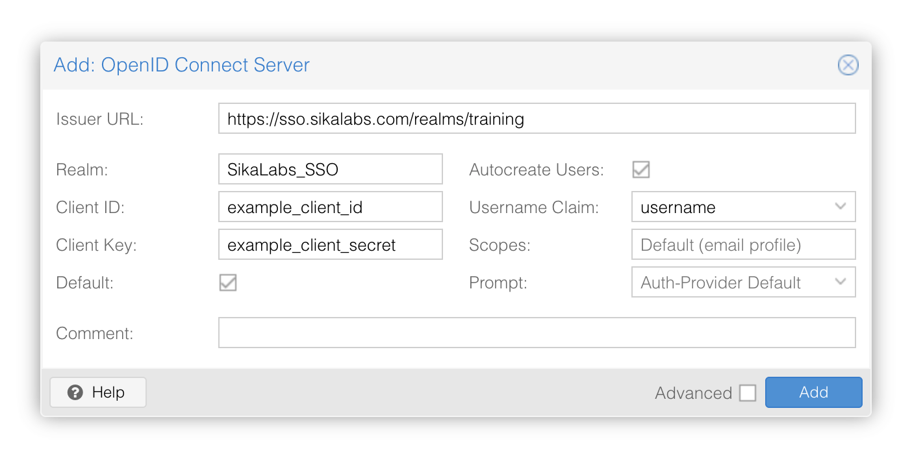
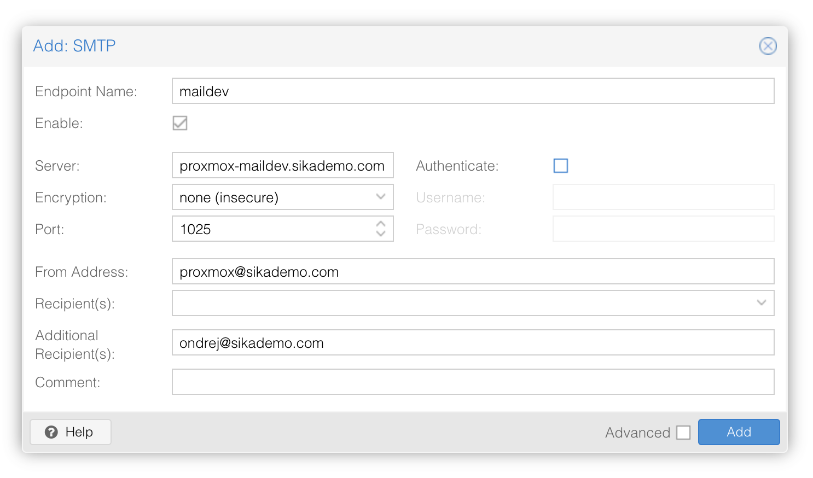

[Ondrej Sika (sika.io)](https://sika.io) | <ondrej@sika.io> | [go to course ->](#course)


# Proxmox Training

    2019 Ondrej Sika <ondrej@ondrejsika.com>
    https://github.com/ondrejsika/proxmox-training

## About Me - Ondrej Sika

__DevOps Engineer, Consultant & Lecturer__

Git, Gitlab, Gitlab CI, Docker, Kubernetes, Terraform, Prometheus, ELK / EFK

## Star, Create Issues, Fork, and Contribute

Feel free to star this repository or fork it.

If you find a bug, create an issue or pull request.

Also, feel free to propose improvements by creating issues.

## Live Chat

For sharing links & "secrets".

- Campfire - https://sika.link/join-campfire
- Slack - https://sikapublic.slack.com/
- Microsoft Teams
- https://sika.link/chat (tlk.io)


## Course

## Agenda

- Introduction to Virtualization, KVM & Proxmox
- Proxmox Node Setup
- Cluster Setup
- Storage
    - Local
    - NFS
    - ZFS
    - CEPH
- Virtual Machines
    - Create VM
    - Cloud Init
    - Snapshots
    - Backup / Restore
    - Replication
    - Migrations between Nodes
- LXC Containers
- Datacenter
    - Scheduled Backups
    - HA
    - Permissions
- SDN
- Prometheus Monitoring
- Beer!


## Proxmox Features

- KVM & LXC Virtualization
- Web Interface, API, CLI & Terraform Support
- HA, Multi-Master
- Many storage plugins (NFS, CIFS, GlusterFS), built-in CEPH

### KVM vs LXC

LXC stands for Linux Containers and KVM is an acronym for Kernel-Based Virtual Machine. The main difference here is that virtual machines require their kernel instance to run while containers share the same kernel. However, each container still acts as its separate environment with their respective file systems.

In other words, containers are virtualization at operating-system-level whereas VMs is virtualization at the hardware level.

[source](https://www.skysilk.com/blog/2019/lxc-vs-kvm/)

### Proxmox & Terraform

#### What is Terraform

Terraform is infrastructure as a code provider. You can define your infrastructure in HCL (pseudo JSON) and apply it. Terraform makes your desired state (described in the file) to actual. More about Terraform on my website <https://ondrej-sika.cz/terraform> (CS only yet).

#### Proxmox Provider

There is not official provider yet :'(

- [Telmate/terraform-provider-proxmox](https://github.com/Telmate/terraform-provider-proxmox)

## Proxmox Docs

<https://pve.proxmox.com/pve-docs/>

## Demo Proxmox

Where `X` is your cluster / lab number

- GUI:
  - `https://pveXnode0.sikademo.com:8006`
  - `https://pveXnode1.sikademo.com:8006`
  - `https://pveXnode2.sikademo.com:8006`

- Username: `root`
- Password: __you get a password at the course__

## Terminology

- PVE - Proxmox Virtual Environment
- Node - Physical node which runs Proxmox & KVM
- VM - Virtual Machine
- CT - LXC Container

## Node Setup

1. SSL
2. Network
3. NAT
4. Port Forwarding

### SSL

You have to set up Let's Encrypt certificates on GUI proxy on port 8006

Go to __Node (demo)__ -> __System__ -> __Certificates__, setup domains & LE account and generate certificates.

### Network

You have to create the network for your VMs.

Go to __Node (demo)__ -> __System__ -> __Network__


Ensure static IP on default bridge (vmbr0) and bridged ports to an active network device (enp1s0).


Help:

```
# Get IP & Mask
ip a

# Get default route
ip route | grep default
```

Create a new bridge for VMs network.


Network Configuration shpuld look like this:


### NAT

If you have only one public IP address you have to set up NAT.

Create IP Tables rule on your node

```
iptables -t nat -A POSTROUTING -s '10.255.0.0/24' -o vmbr0 -j MASQUERADE
```

and enable ip forwarding in sysctl

```
echo "net.ipv4.ip_forward=1" | tee /etc/sysctl.d/99-ipforward.conf
sysctl --system
```

Make IP tables rule persistent

```
apt-get install iptables-persistent
```

```
iptables-save > /etc/iptables/rules.v4
```

### Port Forward

You can setup the SSH port forward into VMs

```
iptables -t nat -A PREROUTING -i vmbr0 -p tcp --dport 9900 -j DNAT --to 10.255.0.100:22
iptables -t nat -A PREROUTING -i vmbr0 -p tcp --dport 9901 -j DNAT --to 10.255.0.101:22
iptables -t nat -A PREROUTING -i vmbr0 -p tcp --dport 9902 -j DNAT --to 10.255.0.102:22
iptables -t nat -A PREROUTING -i vmbr0 -p tcp --dport 9903 -j DNAT --to 10.255.0.103:22
iptables -t nat -A PREROUTING -i vmbr0 -p tcp --dport 9904 -j DNAT --to 10.255.0.104:22
iptables -t nat -A PREROUTING -i vmbr0 -p tcp --dport 9905 -j DNAT --to 10.255.0.105:22
iptables -t nat -A PREROUTING -i vmbr0 -p tcp --dport 9906 -j DNAT --to 10.255.0.106:22
iptables -t nat -A PREROUTING -i vmbr0 -p tcp --dport 9907 -j DNAT --to 10.255.0.107:22
iptables -t nat -A PREROUTING -i vmbr0 -p tcp --dport 9908 -j DNAT --to 10.255.0.108:22
iptables -t nat -A PREROUTING -i vmbr0 -p tcp --dport 9909 -j DNAT --to 10.255.0.109:22
```

And Other ports, for example:

```
# HTTP & HTTPS to proxy VM (101)
iptables -t nat -A PREROUTING -i vmbr0 -p tcp --dport 80  -j DNAT --to 10.255.0.101:80
iptables -t nat -A PREROUTING -i vmbr0 -p tcp --dport 443 -j DNAT --to 10.255.0.101:443

# mail ports to mail VM (102)
iptables -t nat -A PREROUTING -i vmbr0 -p tcp --dport 25  -j DNAT --to 10.255.0.102:25
iptables -t nat -A PREROUTING -i vmbr0 -p tcp --dport 110 -j DNAT --to 10.255.0.102:110
iptables -t nat -A PREROUTING -i vmbr0 -p tcp --dport 143 -j DNAT --to 10.255.0.102:143
iptables -t nat -A PREROUTING -i vmbr0 -p tcp --dport 465 -j DNAT --to 10.255.0.102:465
iptables -t nat -A PREROUTING -i vmbr0 -p tcp --dport 587 -j DNAT --to 10.255.0.102:587
iptables -t nat -A PREROUTING -i vmbr0 -p tcp --dport 993 -j DNAT --to 10.255.0.102:993
iptables -t nat -A PREROUTING -i vmbr0 -p tcp --dport 995 -j DNAT --to 10.255.0.102:995
```

### Persistent IP Tables Rules

```
apt-get install iptables-persistent
```

```
netfilter-persistent save
```

## Disable Enterprise Repositories

```
sudo sed -i "s/^deb/#deb/" /etc/apt/sources.list.d/pve-enterprise.list
sudo sed -i "s/^deb/#deb/" /etc/apt/sources.list.d/ceph.list
```

## Add No Subscription Repository

```
echo "deb http://download.proxmox.com/debian/pve bookworm pve-no-subscription" | sudo tee /etc/apt/sources.list.d/pve-no-subscription.list
```

and update

```
apt-get update
```

## Cluster

You need Proxmox Cluster for:

- CEPH
- HA
- Replication

### Create Cluster


### Copy Join Info


### Join Cluster


## SDN

<https://pve.proxmox.com/pve-docs/chapter-pvesdn.html#pvesdn_installation>

### What is SDN?

Software-defined networking (SDN) is an approach to computer networking that allows network administrators to manage network services through abstraction of lower-level functionality. SDN decouples the network control plane from the data plane, allowing for more flexible and programmable networks.

### SDN Setup

```
apt install libpve-network-perl
```

This is required on training nodes installed on Debian, not on production ISO installation.

```
echo "" >> /etc/network/interfaces
echo "source /etc/network/interfaces.d/*" >> /etc/network/interfaces
```

```
apt update
apt install dnsmasq
# disable default instance
systemctl disable --now dnsmasq
```

```
apt install frr-pythontools
systemctl enable frr.service --now
```

### Simple SDN

### Create simple SDN

Create a new SDN network with CIDR:

```
10.10.10.0/24
```

### VXLAN SDN

### Create VXLAN SDN

Create a new VXLAN SDN network with CIDR:

```
10.10.20.0/24
```

### Create Router for VXLAN SDN

Enable IP Forwarding

```
echo "net.ipv4.ip_forward=1" | tee /etc/sysctl.d/99-ipforward.conf
sysctl --system
```

Install iptables

```
apt-get install iptables iptables-persistent
```

Create NAT rule for VXLAN SDN

```
iptables -t nat -A POSTROUTING -o eth0 -s 10.10.20.0/24 -j MASQUERADE
```

## Storage

### Local

Just a local directory on node's filesystem. You can store anything. You have to use __qcow2 images__ for VM images.

### Download Debian ISO

- https://cdimage.debian.org/debian-cd/current/amd64/iso-cd/
- https://cdimage.debian.org/debian-cd/current/amd64/iso-cd/debian-12.11.0-amd64-netinst.iso

```
cd /var/lib/vz/template/iso/
```

```
wget https://cdimage.debian.org/debian-cd/current/amd64/iso-cd/debian-12.11.0-amd64-netinst.iso
```

```
mv debian-12.11.0-amd64-netinst.iso debian.iso
```

### NFS

We have NFS server running on `nfs.sikademo.com`.

You can run your NFS server, for example from ([Terraform Manifest](https://github.com/ondrejsika/terraform-demo-nfs))

#### Add NFS storage to storage configuration

Got to __Datacenter__ -> __Storage__ and add NFS.


Now, you can store CD Images, Disk Images & Backups on NFC.

#### Copy Local ISO Image to NFS storage

```
cp /var/lib/vz/template/iso/<iso_image> /mnt/pve/<storage_name>/template/iso/
```

Example

```
cp /var/lib/vz/template/iso/debian.iso /mnt/pve/nfs/template/iso/
```

### ZFS

Supports only VM & Container images (storage), no ISO and backups. You have to use __raw images__ on ZFS.

Why Proxmox with ZFS:

- Replication between nodes (partial updates by `zfs send`)
- Easy Migration between nodes

ZFS Features:

- Snapshots
- ZFS Sync

ZFS Resources:

- https://pve.proxmox.com/wiki/ZFS_on_Linux
- https://www.howtoforge.com/tutorial/how-to-use-snapshots-clones-and-replication-in-zfs-on-linux/


### Ceph

Why Proxmox with Ceph:

- HA VMs
- Build-in Ceph Custer (easy setup)

#### What is Ceph

> Ceph is a open-source storage platform, implements object storage on a single distributed computer cluster, and provides interfaces for object-, block- and file-level storage. Ceph aims primarily for completely distributed operation without a single point of failure, and scalable to the exabyte level. -- [wikipedia](https://en.wikipedia.org/wiki/Ceph_(software))

#### Resources

- Ceph Intro & Architectural Overview (video) - <https://www.youtube.com/watch?v=7I9uxoEhUdY>
- Proxmox VE Ceph Benchmark 2018/02 - <https://www.proxmox.com/en/downloads/item/proxmox-ve-ceph-benchmark>

### LVM vs ZFS vs Ceph

Use LVM if

- You want simple, low-overhead local storage.
- You have external RAID or don’t need redundancy at the storage layer.

Use ZFS if

- You need data integrity, snapshots, or replication.
- You’re OK with higher RAM usage.
- Single-node or a few-node setup.

Use Ceph if

- You’re running a Proxmox cluster with high availability and failover needs.
- You have multiple nodes, high-performance networking, and time to manage it.

#### Performance

Feature | ZFS | LVM | Ceph
--- | --- | --- | ---
IOPS | High with cache | High (raw), medium (thin) | Medium (depends on network)
Throughput | High | High | Medium-High
Latency | Low | Low | Higher (due to network overhead)

#### Usecases

Scenario | Recommended Storage
--- | ---
Small homelab or single-node server | ZFS or LVM
Moderate production VM host with snapshot needs | ZFS
Large Proxmox cluster with HA, live migration, and redundancy | Ceph
High-speed local storage with minimal overhead | LVM


## Virtual Machines

### Create VM

### CPU Units vs CPU Limit vs CPU Cores

CPU Units are used to prioritize CPU resources among VMs. The higher the value, the more priority the VM has over others when it comes to CPU allocation.

Feature | Purpose | Behavior
--- | --- | ---
CPU units | Priority when CPU is busy | Relative weight in CPU time allocation
CPU limit | Hard limit on usable CPU (% of core) | Prevents overuse; e.g., limit to 50% of one core
CPU cores | Number of virtual CPUs exposed to VM | Affects VM performance & guest OS behavior

### NUMA

NUMA stands for Non-Uniform Memory Access. It is a memory design used in multiprocessor systems, where the memory access time depends on the memory location relative to a processor. In Proxmox, you can enable NUMA for your VMs to improve performance.

### When to use NUMA?

- When you have a multi-socket CPU and you want to optimize memory access for your VMs.

### When not to use NUMA?

- When you have a single-socket CPU or a low-memory VM.

### Create VM in GUI


### Create VM using CLI

```
qm create <vmid> [ARGS]
```

Example

```
qm create 104 --cdrom local:iso/debian.iso --name demo --net0 virtio,bridge=vmbr0 --virtio0 local:10,format=qcow2 --bootdisk virtio0 --ostype l26 --memory 1024 --onboot no --sockets 1
```

[more](https://pve.proxmox.com/wiki/Qemu/KVM_Virtual_Machines#_managing_virtual_machines_with_tt_span_class_monospaced_qm_span_tt)


### Install Qemu Agent

```
apt-get install qemu-guest-agent
```

### Clone

```
qm clone <sourcevmid> <targetvmid>
```

Example

```
qm clone 100 105
```

### Cloud Init

#### Why Cloud Init?

- Configure your VM on start
- Set root password
- Add SSH key
- Configure hostname & network

#### Use Cloud Init

You have to have cloud-init installed in your template

```
apt-get install cloud-init
```

If you have cloud init installed, it will automatically run on every VM start.


### Snapshots

```
/usr/sbin/qm snapshot <vmid> <snapshot name>
```

Example

```
/usr/sbin/qm snapshot 101 Snapshot_$(date +"%Y_%m_%d_%H_%M_%S")
```

For automatic (cron) snapshots, you can use <https://github.com/kvaps/pve-autosnap>

### Backup / Restore

#### Backup

3 levels of consistency

- stop mode
- suspend mode
- snapshot mode

```
vzdump <vmid> [--mode <mode>] [--storage <storage>]
```
```
vzdump --all
```

Example

```
vzdump 100 --mode snapshot --storage nfs
```

#### Restore

```
qmrestore <file> <vmid>
```

Example

```
qmrestore 100 /mnt/pve/nfs/dump/vzdump-qemu-100-2019_11_29-06_29_48.vma
```

### Migrate VM

Requirements:

- Distributed (eg.: CEPH) storage or __not__ replicated VM image - migration of replicated VMs is described below


### Replication

Requirements:

- Proxmox Cluster
- ZFS Storage for VM image

Resources:

- https://pve.proxmox.com/wiki/Storage_Replication


### Migrate VM Between Replicated Nodes

```
mv /etc/pve/nodes/<node>/qemu-server/<vm_id>.conf /etc/pve/nodes/<new node>/qemu-server/<vm_id>.conf
```

Example

```
mv /etc/pve/nodes/pve0node0/qemu-server/102.conf /etc/pve/nodes/pve0node1/qemu-server/102.conf
```

## Scheduled Backups

Go to __Datacenter__ -> __Backups__


### Create New Schedule Backup


## LXC Containers

### Download Templates

At first, you have to download the container template.

Go to Storage which supports Container Templates, for the example local or NFS.


### Create Container

Go to __Create CT__


## Permissions

Go to __Datacenter__ -> __Permissions__

You can add permissions to other users, groups on VMs, Containers, Storage.

### Resource Pools

You can use resource pools to assign permissions (user, grout) to some resources.

### Workflow

- Create a group
- Create a pool
- Configure pool permissions
- Create users in Proxmox
- Create users in Linux (adduser)
- Add users to groups
- Create a resource in pool / Add resource to pool

## SSO

## SSO using Keycloak

Client

- Realm (Proxmox): `SikaLabs_SSO`
- Issuer: `https://sso.sikalabs.com/realms/training`
- Client ID: `example_client_id`
- Client Secret: `example_client_secret`

User

- Username: `example_username`
- Password: `example_password`




## Notifications

### Setup Maildev

```
cd examples/maildev
```

set `DOCKER_HOST`

```
export DOCKER_HOST=ssh://root@proxmox-maildev.sikademo.com
```

Run Prometheus & Grafana

```bash
make up
```

See: https://proxmox-maildev.sikademo.com

### Setup SMTP Mail Notification



### Prometheus Monitoring

- [prometheus-pve](https://github.com/znerol/prometheus-pve-exporter) (971 stars on Github, maintained)
- [wakeful/pve_exporter](https://github.com/wakeful/pve_exporter) (34 stars on Github, 6 years old last commit)

#### Install prometheus-pve-exporter (Python)

Install [pipx](https://pipx.pypa.io/)

```
apt-get install pipx
```

Install `prometheus-pve-exporter`

```
pipx install prometheus-pve-exporter
```

Create a config file `/etc/prometheus/pve.yml`

```
mkdir -p /etc/prometheus/
cat <<EOF > /etc/prometheus/pve.yml
default:
  user: root@pam
  password: xxx
  verify_ssl: false
EOF
```

Run exporter

```
/root/.local/bin/pve_exporter
```

Or create systemd service

```
cat <<EOF > /etc/systemd/system/prometheus-pve-exporter.service
[Unit]
Description=prometheus-pve-exporter
ConditionPathExists=/
After=network.target

[Service]
Type=simple

ExecStart=/root/.local/bin/pve_exporter
Restart=on-failure
RestartSec=10

[Install]
WantedBy=multi-user.target
EOF
```

Start service

```
systemctl enable prometheus-pve-exporter
systemctl start prometheus-pve-exporter
```

or

```
systemctl enable prometheus-pve-exporter --now
```

#### Wakeful PVE Exporter (Go)

Install

```
wget -O /usr/local/bin/pve_exporter https://github.com/wakeful/pve_exporter/releases/download/0.1.6/pve_exporter-linux-amd64 && chmod +x /usr/local/bin/pve_exporter
```

Run on the node

```
pve_exporter -password <password>
```

Run on the other machine

```
pve_exporter -pve-url <pve_url> -password <password>
```

Listen on port 9090

#### Ceph Monitoring

Enable Prometheus metrics

```
ceph mgr module enable prometheus
```

The metrics are available on port 9283 on managers

```
curl http://10.250.0.2:9283/metrics
```

you can setup port forwarding to be able to scrape metrics from your Prometheus server

```
iptables -t nat -A PREROUTING -i vmbr0 -p tcp --dport 9283 -j DNAT --to-destination 10.250.0.2:9283
iptables -t nat -A POSTROUTING -d 10.250.0.2 -p tcp --dport 9283 -j MASQUERADE
```

#### Run Demo Prometheus

You need to have Prometheus installed

```
git clone https://github.com/ondrejsika/proxmox-training
cd proxmox-training

cd prometheus
# run Prometheus
prometheus
```

Go to <http://127.0.0.1:9090/graph>

## Grafana Dashboard for Proxmox

- https://grafana.com/grafana/dashboards/10347-proxmox-via-prometheus/ or use `10347`

## Ceph Dashboards for Grafana

https://github.com/ceph/ceph/tree/main/monitoring/ceph-mixin/dashboards_out

## Run Prometheus and Grafana

```
cd examples/monitoring
```

set `DOCKER_HOST`

```
export DOCKER_HOST=ssh://root@monitoring.sikademo.com
```

Run Prometheus & Grafana

```bash
make up
```

See:

- Prometheus - <https://prometheus.monitoring.sikademo.com>
- Grafana - <https://grafana.monitoring.sikademo.com>

## Thank you! & Questions?

That's it. Do you have any questions? __Let's go for a beer!__

### Ondrej Sika

- email: <ondrej@sika.io>
- web: <https://sika.io>
- twitter: 	[@ondrejsika](https://twitter.com/ondrejsika)
- linkedin:	[/in/ondrejsika/](https://linkedin.com/in/ondrejsika/)
- Newsletter, Slack, Facebook & Linkedin Groups: <https://join.sika.io>

_Do you like the course? Write me a recommendation on Twitter (with handle `@ondrejsika`) and LinkedIn (add me [/in/ondrejsika](https://www.linkedin.com/in/ondrejsika/) and I'll send you Request for the recommendation). __Thanks__._

Wanna go for a beer or do some work together? Just [book me](https://book-me.sika.io) :)


## Resources

- Proxmox KVM - <https://pve.proxmox.com/wiki/Qemu/KVM_Virtual_Machines>
- Proxmox Command Line Tools - <https://pve.proxmox.com/wiki/Command_line_tools>
- Backup & Restore - <https://pve.proxmox.com/wiki/Backup_and_Restore>
- Cloud Init - <https://pve.proxmox.com/wiki/Cloud-Init_Support>
- Cloud Init FAQ - <https://pve.proxmox.com/wiki/Cloud-Init_FAQ>
- Proxmox on Single IP Address - <https://www.guyatic.net/2017/04/10/configuring-proxmox-ovh-kimsufi-server-single-public-ip/>
- Persistent IP Tables Rules - <https://www.thomas-krenn.com/en/wiki/Saving_Iptables_Firewall_Rules_Permanently>
- Install Proxmox on Debian - <https://computingforgeeks.com/how-to-install-proxmox-ve-on-debian/>
- Upgrade from 5.x to 6.0 - <https://pve.proxmox.com/wiki/Upgrade_from_5.x_to_6.0>
- ZFS on Linux (Proxmox Wiki) - <https://pve.proxmox.com/wiki/ZFS_on_Linux>
- Snapshots, Clones & Replication in ZFS on Linux - <https://www.howtoforge.com/tutorial/how-to-use-snapshots-clones-and-replication-in-zfs-on-linux/>
- Proxmox VE Ceph Benchmark 2018/02 - <https://www.proxmox.com/en/downloads/item/proxmox-ve-ceph-benchmark>
- Ceph Intro & Architectural Overview (video) - <https://www.youtube.com/watch?v=7I9uxoEhUdY>
- Simple SDN (article) - <https://www.virtualizationhowto.com/2024/03/proxmox-sdn-configuration-step-by-step/>
- Simple SDN (video) - <https://www.youtube.com/watch?v=gYSxGCiLeto>
- VXLAN SDN (video) - <https://www.youtube.com/watch?v=kMcr05zRVVw>

## Debug

#### Connect to Proxmox UI using port forwarding and jump host

```
ssh -L 8006:localhost:8006 -J root@pve0node3.sikademo.com root@10.250.99.2
```
